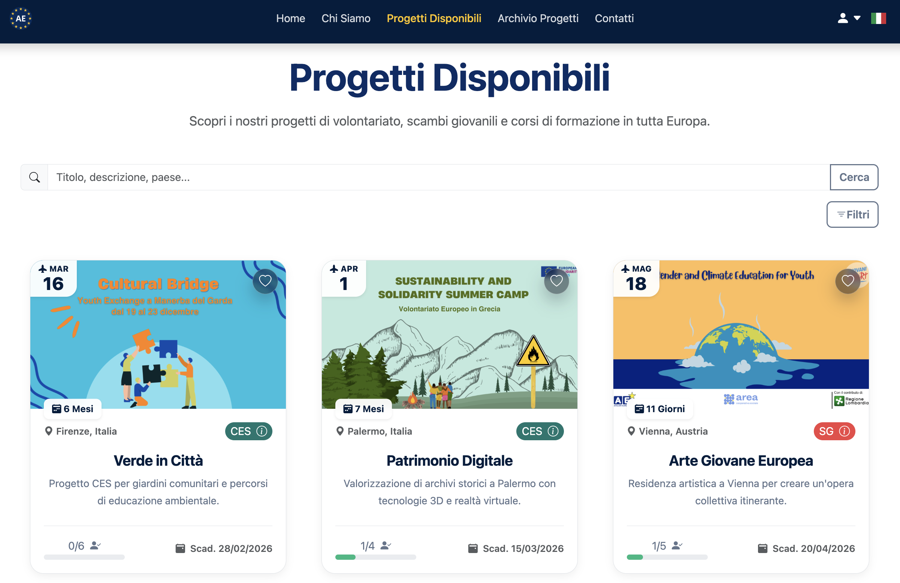
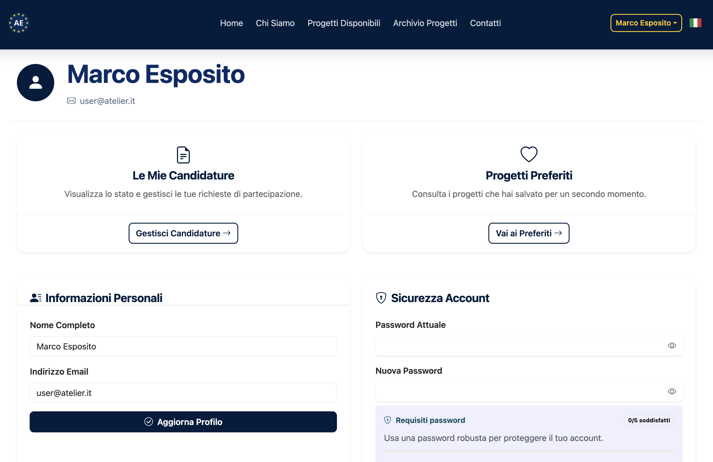
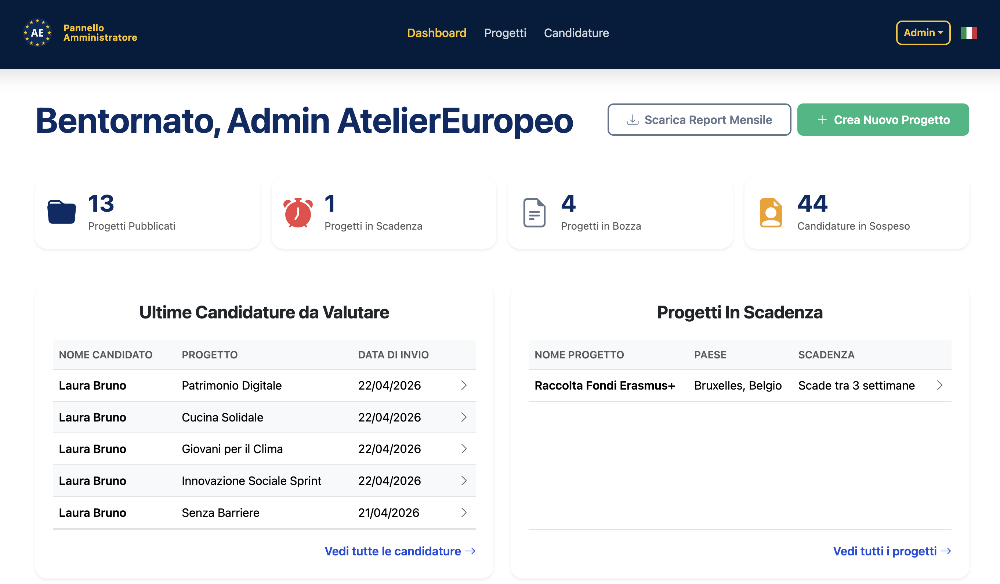

# Atelier Europeo IPC


## About the Project

**EU Mobility Portal** is a comprehensive web application designed to centralize and manage European mobility opportunities. Originally developed as an academic project for Web Programming and Human-Computer Interaction (HCI) courses, it serves as a bridge between users seeking mobility projects and administrators managing the application lifecycle.

The platform provides a seamless onboarding experience for users to browse, save favorites, and apply for projects, while offering an operational dashboard for administrators to handle the entire application workflow, from review to final approval.

### Screenshots

> **Public Catalog**
> 
>
> **User Dashboard & Application Status**
> 
>
> **Admin Panel**
> 

## Key Features

- **Role-Based Access Control (RBAC):** Distinct interfaces and capabilities for registered users and platform administrators.
- **Project Catalog & Portfolio:** A searchable public catalog of available mobility projects.
- **Complete Application Workflow:** Users can apply for projects and track their status (`Pending`, `Approved`, `Rejected`).
- **Admin Dashboard:** Comprehensive tools for admins to review applications, send feedback messages, and track updates.
- **User Personalization:** Features a user profile system and a "Favorites" list for saving interesting opportunities.
- **Full Localization:** Native bilingual support (IT/EN) handled via middleware with a UI language switch.
- **Responsive UI & Validation:** Mobile-first frontend design with strict server-side validation for data integrity.

## Architecture & Engineering Highlights

This project was built with modern software engineering principles in mind:

- **DataLayer / Repository Pattern:** Business logic and data access are decoupled using a repository-like structure, ensuring cleaner controllers and easier testing.
- **Robust State Management:** The application workflow includes concurrency checks (e.g., verifying maximum participant limits _before_ approval) to strictly prevent overbooking.
- **Audit Trails:** Administrative actions on applications are fully tracked (who updated the status and when), ensuring operational transparency and easier debugging.
- **Secure Routing:** Strict separation of concerns between public areas, authenticated user routes, and admin panels using Laravel Route Groups and Middleware.

## Tech Stack

- **Backend:** PHP 8.2+, Laravel 12
- **Frontend:** Blade Templates, Vite 6, Tailwind CSS, Alpine.js, Bootstrap (+ Icons)
- **Database:** SQLite / MySQL (In-memory SQLite for testing)
- **Authentication:** Laravel Breeze
- **Tooling & Quality Assurance:** Pest & PHPUnit for testing, Laravel Pint for code styling.

## 🚀 Getting Started

Follow these instructions to set up the project locally.

### Prerequisites

- PHP 8.2 or higher
- Composer
- Node.js & npm

### Installation

1. Clone the repository:
    ```bash
    git clone [https://github.com/SickCiQuattro/AtelierEuropeo_IPC.git](https://github.com/SickCiQuattro/AtelierEuropeo_IPC.git)
    cd eu-mobility-portal
    ```
2. Install PHP dependencies:
    ```bash
    composer install
    ```
3. Set up environment variables:

    ```bash
    cp .env.example .env
    php artisan key:generate
    ```

4. Configure and run the database:

    ```bash
    touch database/database.sqlite
    # Make sure DB_CONNECTION=sqlite in your .env file
    php artisan migrate --seed
    ```

5. Install and compile frontend assets:
    ```bash
    npm install
    composer run dev # or npm run dev
    ```
6. Start the local development server:
    ```bash
    php artisan serve
    ```

### Testing & Tooling

To run the test suite (powered by Pest):

```bash
php artisan test
```

To build assets for production:

```bash
npm run build

```

---
